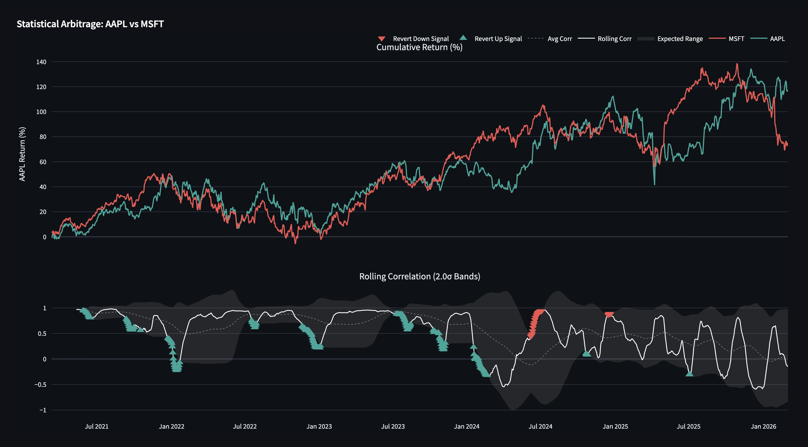
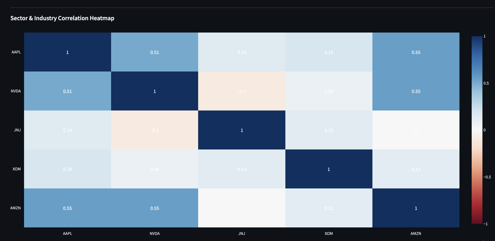
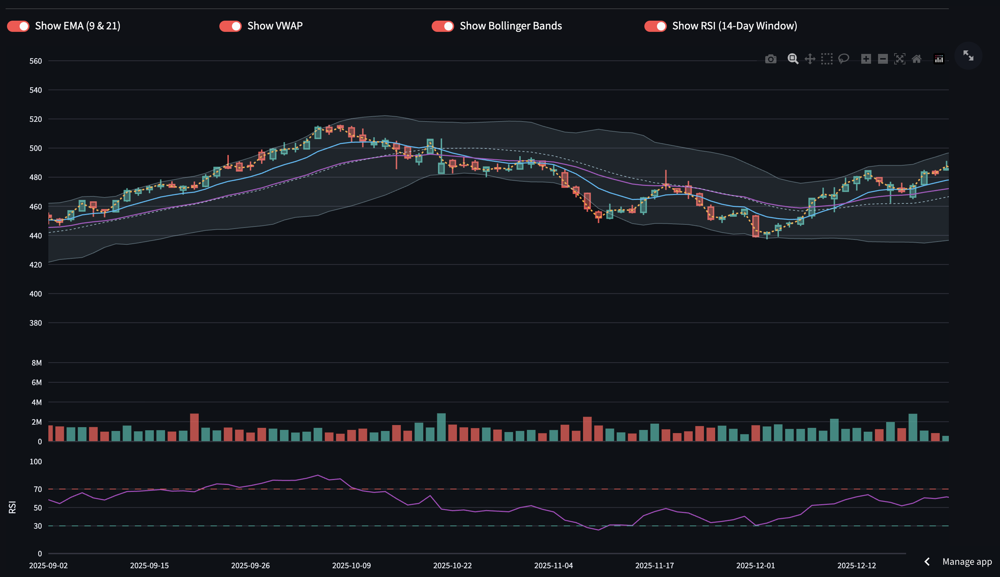

# Quantitative Market Monitor & Statistical Arbitrage Engine 

[](https://www.python.org/)
[](https://streamlit.io/)
[](https://pandas.pydata.org/)
[](https://supabase.com/)

**Live Production Environment:** (https://quant-market-monitor-vvtql3vkkdq7th5qr9ahxc.streamlit.app/#apple-inc-aapl)

A high-performance quantitative market analysis platform engineered to visualize market microstructure, benchmark portfolio risk metrics, and identify statistical mean-reversion signals. Built with a focus on vectorized data processing and robust handling of asynchronous market states.

<video controls src="assets/dashboard.mp4" title="The goat's Market Monitor"></video>

## 📊 Core Quantitative Features

### 1. Statistical Arbitrage & Mean Reversion (Pairs Trading)
Identifies divergence and convergence signals between correlated equities. 
* Calculates a 50-day rolling Pearson correlation matrix.
* Generates trading signals based on z-score normalization, plotting $2.0\sigma$ threshold bands to visualize potential arbitrage opportunities when the spread deviates from the historical mean.



### 2. Market Microstructure & Technical Overlays
An interactive, high-frequency charting engine built with Plotly Graph Objects. 
* **Dynamic Volatility Channels:** Calculates 20-period Bollinger Bands utilizing a Simple Moving Average ($\mu$) and rolling standard deviation ($\sigma$).
  $$UB = \mu + (2 \cdot \sigma)$$
  $$LB = \mu - (2 \cdot \sigma)$$
* **Momentum & Volume Tracking:** Vectorized calculations for Relative Strength Index (RSI, 14-period), Exponential Moving Averages (EMA 9/21), and Volume Weighted Average Price (VWAP).


### 3. Risk Management & Performance Benchmarking
Automates the calculation of core portfolio metrics relative to the S&P 500 (SPY) baseline to evaluate risk-adjusted returns:
* **Alpha ($\alpha$) & Beta ($\beta$)**
* **Sharpe Ratio:** $S = \frac{R_p - R_f}{\sigma_p}$
* **Maximum Drawdown & Period Volatility**

## 🏗️ Data Engineering & Architecture

Financial data is inherently messy. This engine is specifically designed to handle the nuances of live market hours, timezone conversions, and non-trading periods seamlessly.

* **Zero-Volume Heuristic Filtering:** Implemented a custom categorical X-axis combined with zero-volume filtering to natively strip out weekend and holiday "zombie data." This prevents WebGL renderer infinite-loop crashes on high-density datasets.
* **Asynchronous Market State Logic:** Integrates live market webhooks with automated database fallback logic. If the market is closed, the engine seamlessly queries historical End-of-Day (EOD) tables to calculate previous-day $\Delta$ and percentage changes without breaking the UI.
* **Pipeline Infrastructure:**
    * **Ingestion:** Massive REST API for live snapshots and historical OHLCV data.
    * **Storage:** Supabase (PostgreSQL) for centralized, persistent historical ticker data.
    * **Processing:** Pandas and NumPy for $O(N)$ vectorized cumulative returns, rolling statistics, and cross-asset inner-joins to ensure strict date alignment.

## 🚀 Local Deployment

Clone the repository and initialize the environment:

```bash
git clone [https://github.com/](https://github.com/)[YourUsername]/[YourRepoName].git
cd [YourRepoName]
pip install -r requirements.txt
